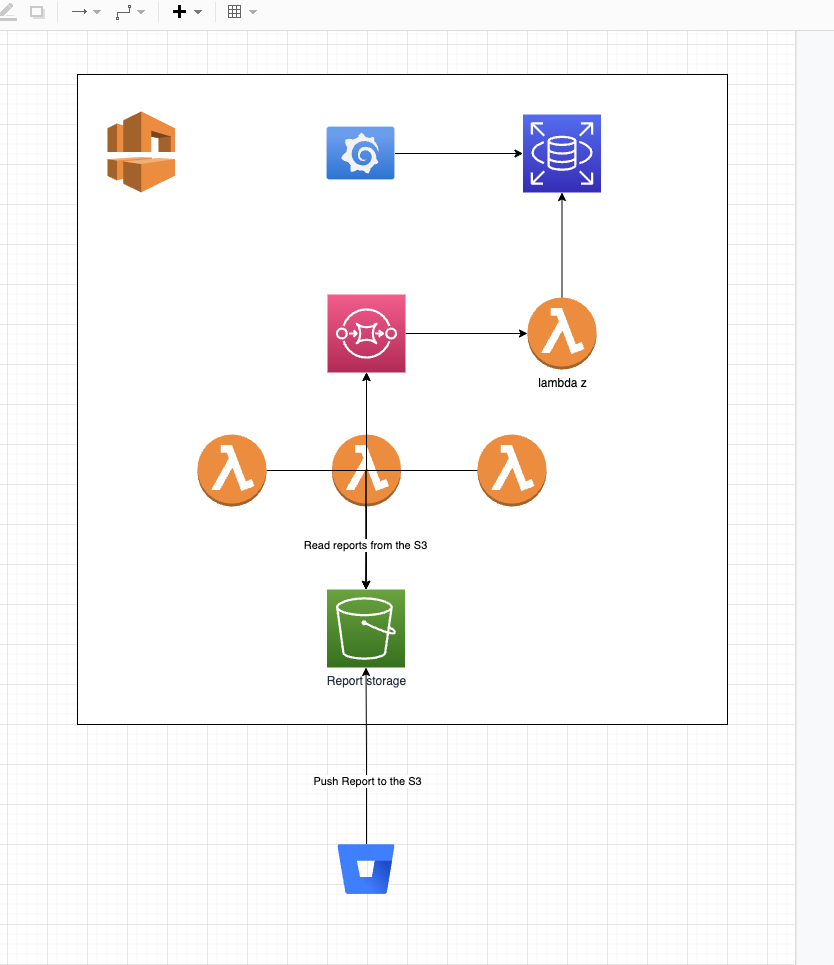
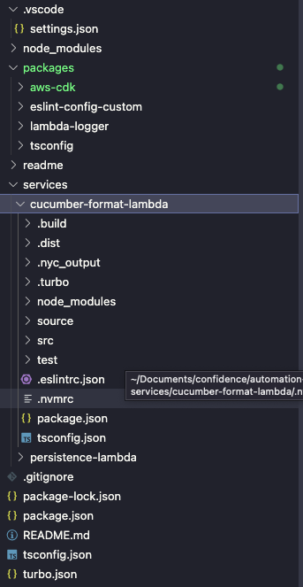
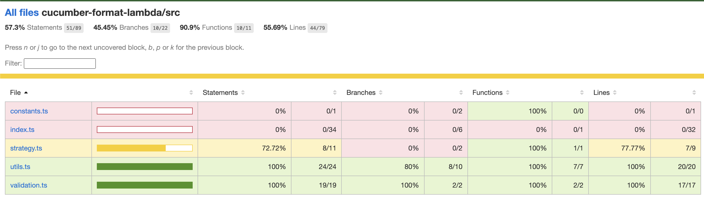

# Report automation
[](https://drone2.planbit.net/pmpwith2i/report_automation)

This is a POC of a report automation suite using AWS cloud

## Introduction

This repo contains the automation stack for the automatic reports review. Is a project build with a mono repository approach. This project was created with the goal of automatic take reports from the automation and store into a DB (accessed by Grafana).

## Project overview

The stack of this project is built on top of AWS. The IaC used is the AWS-CDK (https://docs.aws.amazon.com/cdk/api/v2/).



## How it works

Once that an automation suite is completed the reports (usually in JSON) is uploaded into an S3 Bucket.
Once that the file is uploaded one of the lambdas that are listening on the S3 take the report and formats it. The formatted report is sent to an **SQS** that trigger another lambda, that will insert datas into the DB.

## Project setup

- npm install
- npm run build

## Available commands

- npm run lint
- npm run format
- npm run test

## Project structure



The project is a mono-repository with two workspaces: **packages** and **services**

### Packages

Inside packages we have shared lib and the cdk project. You can find the configuration of tsconfig and eslint for example.

### Usage of tsconfig

There is a project under **packages/tsconfig.json** where you can find different available ts configuration (with the name \*_.json_). You can import these configuration into every project adding this dependencies:

```
 "@packages/tsconfig": "*",
```

and then you can add a tsconfig file into the project with this format

```
{
  "extends": "@packages/tsconfig/base.json",
  "compilerOptions": {
    "outDir": ".dist",
    "rootDir": "./",
    "baseUrl": "src"
  },
  "include": ["./src", "./test"]
}
```

### Usage of eslint

As for tsconfig you can import the eslint lib into any project as a dependency

```
 "@packages/eslint-config-custom": "*",
```

and then use in the project by adding the following **eslintrc.json** file

```
{
  "root": true,
  // This tells ESLint to load the config from the package `eslint-config-custom`
  "extends": ["@packages/eslint-config-custom/ts"]
}
```

## Deploy
The deploy of the application is provided by the **AWS CDK**. The CDK is used to deploy the lambdas on AWS. You can find the files of cdk under the folder *packages/aws-cdk/*. The entrypoint of the cdk is the file *bin/aws-cdk.ts*.
Before deploying an application you have to setup an account on AWS and export the access keys. Then you have to setu your environment by runnning (you need to install the aws-cli before this)
```
aws configure
cd packages/aws-cdk
npx cdk bootstrap
npx cdk synth
```
After this you can back to the root of the project and you can create a .env file
```
touch .env
```
After this you have to fill out your .env with the env variables that you can find in the file *.env.sample*
After this you're ready for deploy.
```
. ./load_dotenv.sh ## only in local
npm run deploy
```

## Test and Coverage
The coverage of the project is provided by nyc. For getting the coverage run these commands (the build command is not mandatory but in most cases it prevent cache issues :) )
```
npm run build
npm run coverage
```
You'll see the results of coverage under the folder *coverage/* by opening the file **index.html** 


